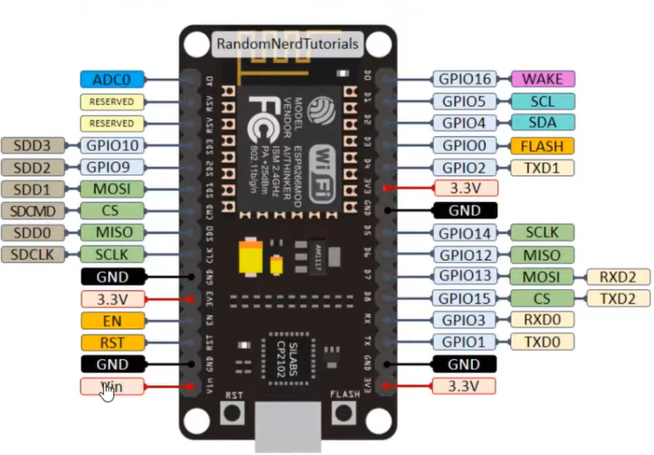

# Arsitekut ESP32

ESP32 adalah sebuah mikrokontroler yang dikembangkan oleh Espressif Systems. Mikrokontroler ini memiliki dua CPU Xtensa 32-bit yang dapat berjalan pada frekuensi hingga 240 MHz. ESP32 juga dilengkapi dengan memori flash dan RAM, serta berbagai peripheral seperti UART, SPI, I2C, dan GPIO.



## Informasi  

```
Connected to ESP32 on COM7:
Chip type:          ESP32-D0WD-V3 (revision v3.1)
Features:           Wi-Fi, BT, Dual Core + LP Core, 240MHz, Vref calibration in eFuse, Coding Scheme None
Crystal frequency:  40MHz
MAC:                24:dc:c3:46:b2:fc
```

## Pin HIGH

## PIN LOW

## PIN SENSOR

## PIN RESET

## I2C

## SPI

## UART

## Capacitive Touch GPIO

## PWM 