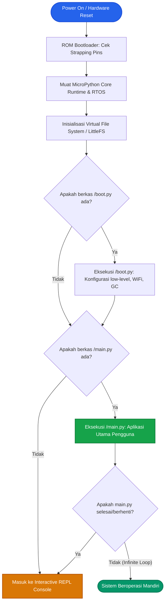

<h1 align="center">
BAB 3 <br> 
Gas Upload 
</h1>


## Prolog: Dari Kode ke Dunia Nyata

Halo, *tech enthusiast*! Di Bab 1 dan 2 kita sudah menyiapkan *environment* dan membedah jeroan silikon ESP32 sampai ke level arsitektur dan karakteristik pinout-nya. Sekarang waktunya kita masuk ke arena sesungguhnya: mengubah deretan kode Python di layar komputer menjadi aksi fisik di dunia nyata!

Ibarat tradisi sakral software engineer yang wajib mencetak teks `"Hello World"` di layar konsol, dunia *embedded systems* dan mikrokontroler punya ritual inisiasinya sendiri: **Blink LED** alias membuat lampu indikator berkedip.

Di bab ini, kita tidak hanya sekadar menyalin skrip agar lampu menyala. Kita akan membongkar tuntas:

* Bagaimana arsitektur pin GPIO2 mengalirkan arus ke sirkuit LED.
* Perbedaan mendasar antara eksekusi memori temporer (RAM) vs penyimpanan permanen (Flash).
* Bagaimana `adafruit-ampy` memanfaatkan konsol Raw REPL untuk mentransfer byte kode.
* Mengapa berkas `boot.py` dan `main.py` memegang peranan krusial dalam siklus hidup MicroPython.

---

## Analisis Sirkuit & Skema Hardware

Hampir semua modul dev-kit ESP32 populer (baik tipe NodeMCU ESP32 30-pin maupun varian 38-pin DOIT DevKit V1) sudah dilengkapi dengan sebuah LED onboard kecil berwarna biru atau merah. Komponen ini dirancang pabrikan agar kita bisa langsung memverifikasi fungsi chip tanpa perlu repot merangkai breadboard atau resistor eksternal.

### Tabel Spesifikasi Pinout

| Komponen Hardware | Label Pin Board | Nomor GPIO Internal | Tipe Konfigurasi | Level Logika | Status Fisik LED | Keterangan Sirkuit |
| :--- | :--- | :--- | :--- | :--- | :--- | :--- |
| **On-board LED** | D2 / IO2 | `GPIO2` | `Pin.OUT` (Digital Output) | `HIGH` ($3.3\text{ V}$) | **Menyala (ON)** | Mengalirkan arus *source* via resistor pembatas internal ($1\text{ k}\Omega - 2\text{ k}\Omega$) |
| **On-board LED** | D2 / IO2 | `GPIO2` | `Pin.OUT` (Digital Output) | `LOW` ($0\text{ V}$ / GND) | **Padam (OFF)** | Sirkuit tertutup tanpa beda potensial terhadap ground |

### Bedah Elektronika: Active-High vs Active-Low

Secara umum, LED onboard pada GPIO2 ESP32 menggunakan konfigurasi **Active-High**. Konsep kerjanya:

* Ketika pin diberi tegangan $3.3\text{ V}$ (`HIGH` atau angka biner `1`), terjadi beda potensial antara GPIO2 dan GND yang mendorong arus listrik melewati dioda LED, sehingga lampu menyala.
* Ketika pin ditarik ke $0\text{ V}$ (`LOW` atau angka biner `0`), tegangan kedua kutub seimbang di titik nol, arus berhenti mengalir, dan lampu padam.

> **Catatan Kritis Engineer:**  
> Ingat bahasan Bab 2 mengenai **Strapping Pins**! GPIO2 adalah salah satu pin strapping yang dipantau ESP32 saat proses booting (*reset*). Jika Anda menghubungkan beban eksternal ke GPIO2 yang menarik pin tersebut secara tidak stabil saat chip baru menyala, ESP32 berisiko gagal masuk ke mode eksekusi normal. Hindari memasang beban induktif berat langsung pada pin ini.

---

## Bedah Kode Program MicroPython

Buka teks editor favorit Anda (VS Code, Thonny, atau editor teks lainnya), lalu buat berkas baru bernama `led_kedip.py`. Masukkan baris instruksi berikut:

```python
from machine import Pin
from time import sleep_ms

# 1. Inisialisasi Hardware
# Membuat objek pin bernama 'led' yang merujuk ke GPIO2 dengan mode Digital Output
led = Pin(2, Pin.OUT)

print("Program Blink LED dimulai...")

# 2. Siklus Eksekusi Tanpa Henti (Super Loop)
while True:
    led.value(1)       # Mengirim sinyal logika HIGH (3.3V) -> LED Menyala
    sleep_ms(1000)     # Menunda eksekusi selama 1000 milidetik (1 detik)
    
    led.value(0)       # Mengirim sinyal logika LOW (0V) -> LED Padam
    sleep_ms(1000)     # Jeda 1 detik berikutnya
```

### Anatomi Teknis Setiap Baris Kode

1. **`from machine import Pin`**  
   Modul `machine` adalah modul inti (*low-level driver*) bawaan MicroPython yang ditulis langsung dalam bahasa C. Modul ini berinteraksi langsung dengan register prosesor ESP32. Kelas `Pin` di dalamnya menangani fungsi multiplexer pin (GPIO MUX), pengaturan pull-up/pull-down resistor internal, hingga pengarah arus (*drive strength*).

2. **`from time import sleep_ms`**  
   MicroPython menyediakan modul waktu yang diadaptasi khusus untuk mikrokontroler. Fungsi `sleep_ms()` menghentikan sementara jalannya instruksi program dalam skala milidetik secara presisi dengan timer hardware, tanpa membebani kalkulasi aritmatika CPU.

3. **`led = Pin(2, Pin.OUT)`**  
   Baris ini menginstansiasi objek `led`. Parameter pertama (`2`) mendefinisikan nomor fisik GPIO (bukan nomor urut kaki modul fisik). Parameter kedua (`Pin.OUT`) mengonfigurasi transistor internal ESP32 agar bertindak sebagai gerbang pengirim tegangan (*push-pull driver*).

4. **Metode Alternatif Manipulasi Pin:**  
   Di MicroPython, Anda dapat menggunakan beberapa sintaks ekuivalen:
   * `led.value(1)` setara dengan `led.on()` (logika HIGH).
   * `led.value(0)` setara dengan `led.off()` (logika LOW).
   * **Trik Toggle Cepat:** Membalik kondisi pin saat ini secara ringkas:
     ```python
     led.value(not led.value())
     ```

---

## Metode 1: Eksekusi Dinamis Menggunakan `ampy run`

Saat tahap perancangan awal (*prototyping*), kita kerap hanya ingin menguji potongan logika program tanpa perlu menulis ulang memori flash chip. Di sinilah sub-perintah `ampy run` sangat berguna.

### 3.4.1 Langkah Eksekusi Praktik

1. Hubungkan board ESP32 ke komputer via kabel data USB.
2. Buka Terminal / Command Prompt dan arahkan direktori aktif ke folder tempat berkas `led_kedip.py` disimpan.
3. Pastikan nomor COM port perangkat (contoh: `COM7`).
4. Jalankan perintah:

```bash
ampy --port COM7 run led_kedip.py
```

### Alur Komunikasi di Balik Layar (*Under the Hood*)

Ketika perintah dieksekusi, `ampy` tidak menyalin berkas ke sistem penyimpanan flash, melainkan membajak antarmuka serial REPL ke mode transmisi data biner mentah (*Raw REPL*). Alur interaksinya digambarkan pada diagram berikut:

```mermaid
sequenceDiagram
    autonumber
    actor Dev as Komputer (Host / ampy)
    participant ESP as ESP32 (MicroPython Core)
    participant RAM as SRAM ESP32

    Dev->>ESP: Kirim karakter kontrol Ctrl-C (\x03)
    Note over ESP: Menghentikan program/loop aktif
    Dev->>ESP: Kirim karakter kontrol Ctrl-A (\x01)
    Note over ESP: Masuk ke mode Raw REPL
    ESP-->>Dev: Respon balasan: "raw REPL; OK"
    Dev->>RAM: Kirim payload teks sumber 'led_kedip.py'
    Dev->>ESP: Kirim karakter kontrol Ctrl-D (\x04)
    Note over ESP,RAM: Kompilasi payload ke bytecode & jalankan
    ESP-->>Dev: Kirim stream output terminal ("Program Blink LED dimulai...")
```

* **Sifat Volatile:** Karena kode hanya dimuat ke memori kerja (SRAM), begitu Anda menekan tombol **EN/RESET** fisik atau memutuskan suplai daya, program akan langsung terhapus dari memori aktif.

---

## Penyimpanan Permanen dengan `main.py`

Jika perangkat IoT sudah siap dioperasikan secara mandiri (*standalone*) menggunakan suplai baterai atau adaptor dinding di luar jangkauan PC, program harus disimpan ke dalam memori non-volatile.

### 3.5.1 Urutan Booting MicroPython (*Boot Sequence Architecture*)

ESP32 yang terpasang MicroPython mengelola sistem berkas virtual (*Virtual File System* / VFS) bertipe **LittleFS** di memori SPI Flash. Diagram alur berikut mengilustrasikan tahapan booting hingga kode pengguna dieksekusi:



### Prosedur Upload Berkas Permanen

1. **Ubah nama berkas:** Simpan berkas logika kerja Anda dengan nama baku: **`main.py`**.
2. **Unggah ke Flash:** Gunakan sub-perintah `put`:

```bash
ampy --port COM7 put main.py
```

3. **Verifikasi Operasi Mandiri:**
   * Cabut kabel USB dari komputer.
   * Hubungkan ESP32 ke adaptor daya eksternal atau powerbank.
   * Lampu LED indikator akan langsung berkedip otomatis sesaat setelah tegangan masuk, menandakan chip telah menjalankan `main.py` secara mandiri.

---

## Panduan Perintah Operasional `ampy`

Berikut rangkuman perintah esensial utilitas `ampy` untuk manajemen berkas pada penyimpanan chip:

```bash
# 1. Menampilkan daftar berkas di direktori root ESP32
ampy --port COM7 ls

# 2. Mengambil (download) berkas dari ESP32 ke komputer
ampy --port COM7 get main.py > backup_main.py

# 3. Menghapus berkas dari memori ESP32
ampy --port COM7 rm main.py

# 4. Membuat subdirektori baru (misalnya folder pustaka pihak ketiga)
ampy --port COM7 mkdir /lib

# 5. Mengunggah pustaka eksternal ke dalam direktori /lib
ampy --port COM7 put dht22.py /lib/dht22.py
```

---

## Mitigasi Masalah & Troubleshooting

### Kasus 1: Board Terkunci dalam Infinite Loop
Jika skrip `main.py` menjalankan perulangan ketat tanpa jeda `sleep_ms`, seluruh siklus CPU akan terserap penuh. Akibatnya, chip menolak permintaan Raw REPL dari `ampy` dan memunculkan galat `ampy.pyboard.PyboardError: could not enter raw repl`.

**Solusi:**
1. Buka Serial Monitor (misal melalui Thonny atau PuTTY) pada baud rate `115200`.
2. Tekan **`Ctrl + C`** beberapa kali secara cepat untuk memicu *KeyboardInterrupt*.
3. Setelah muncul prompt REPL (`>>>`), hapus skrip bermasalah melalui perintah:
   ```python
   import os
   os.remove('main.py')
   ```

### Kasus 2: Akses Serial Ditolak (*Port Busy / Access Denied*)
Komunikasi UART bersifat eksklusif (*single process access*). Pastikan tidak ada aplikasi terminal serial lain (Thonny, PuTTY, Arduino IDE, atau Serial Monitor VS Code) yang sedang aktif sebelum menjalankan perintah `ampy`.

---

## Rangkuman

1. Kontrol logika GPIO output bertumpu pada beda potensial terhadap ground ($3.3\text{ V}$ untuk status `HIGH` dan $0\text{ V}$ untuk `LOW`).
2. Perintah `ampy run` menyuntikkan kode langsung ke SRAM melalui protokol *Raw REPL* untuk keperluan pengujian sementara (*volatile*).
3. Perintah `ampy put` menuliskan berkas ke memori non-volatile (LittleFS). Berkas bernama `main.py` akan otomatis dieksekusi setiap kali mikrokontroler menyala atau di-reset.
4. Selalu sisipkan fungsi jeda waktu (`sleep_ms`) di dalam blok loop tak hingga untuk menjaga stabilitas sistem dan ketersediaan alokasi interupsi serial.
