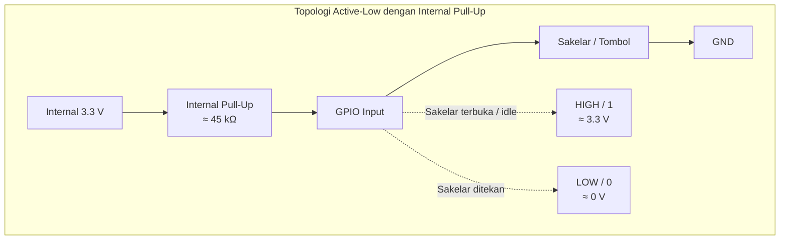
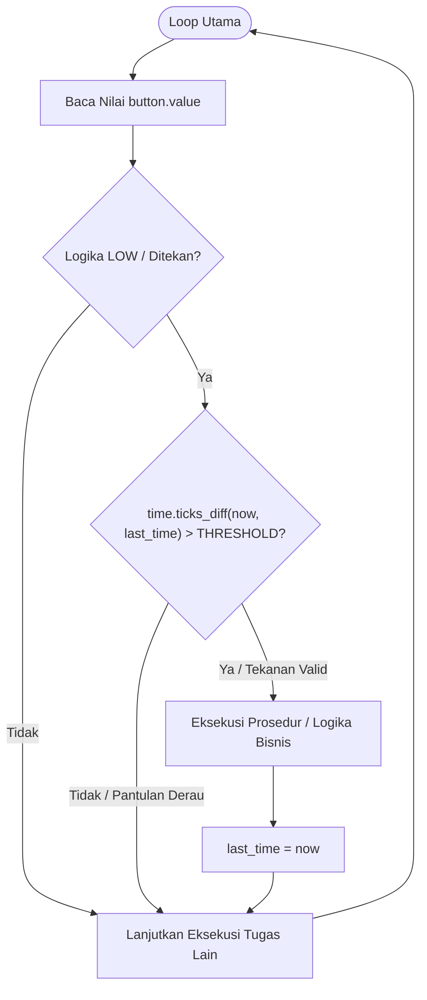

<h1 align="center">BAB 4: Menguasai Input Push Button, Debouncing, dan Proyek Undian PBB</h1>

## Pendahuluan

Pada bab sebelumnya, ESP32 telah difungsikan untuk mengirimkan sinyal kendali ke dunia fisik melalui antarmuka keluaran digital (*digital output*). Untuk membangun sistem embedded yang interaktif dan responsif, mikrokontroler juga harus memiliki kemampuan menerima informasi dari pengguna atau lingkungan melalui antarmuka masukan (*digital input*).

Salah satu komponen input mekanis paling fundamental adalah **Push Button** (sakelar tombol tekan). Kendati terlihat sederhana secara fisik, integrasi sakelar mekanik dengan sirkuit mikroelektronika berkecepatan tinggi menghadirkan tantangan teknis, seperti kondisi ambang tak tentu (*floating state*) dan derau kontak mekanis (*mechanical contact bounce*).

Bab ini mengupas tuntas:
* Fenomena kelistrikan pada pin input dan pemanfaatan resistor internal (*internal pull-up/pull-down*).
* Dinamika getaran sakelar mekanis serta teknik penanganannya (*software debouncing* berbasis pewaktuan).
* Praktikum implementasi: **Mesin Simulator Pengundian PBB (Pajak Bumi dan Bangunan)** dengan animasi LED roulette dinamis.
* Paradigma pemrosesan input: perbandingan antara metode *Polling* dan *Hardware Interrupts* (IRQ).

---
# Floating State & Resistor Internal

Sebuah pin input digital ESP32 memiliki impedansi masukan yang sangat tinggi (orde Mega-Ohm). Ketika pin tersebut dikonfigurasi sebagai input tanpa referensi tegangan yang pasti (tidak terhubung ke $3.3\text{ V}$ maupun ke $\text{GND}$), pin berada dalam kondisi mengambang (**floating**). 

Dalam status floating, pin akan bertindak layaknya antena yang menangkap radiasi gelombang elektromagnetik dan derau elektrostatis di sekitarnya. Hal ini menyebabkan register baca logika bernilai acak antara level `0` dan `1`.

Untuk mengunci level tegangan saat tombol dalam keadaan terbuka (*idle*), diterapkan rangkaian resistor pembatas:

1. **Pull-Up Resistor:** Menghubungkan pin GPIO ke rel tegangan positif ($3.3\text{ V}$). Saat sakelar terbuka, pin berada pada logika `HIGH` (`1`). Saat sakelar ditekan (menutup ke Ground), pin ditarik ke logika `LOW` (`0`). Konfigurasi ini dikenal sebagai **Active-LOW**.
2. **Pull-Down Resistor:** Menghubungkan pin GPIO ke rel $\text{GND}$. Saat sakelar terbuka, pin berada pada logika `LOW` (`0`). Saat sakelar ditekan (menutup ke $3.3\text{ V}$), pin naik ke logika `HIGH` (`1`). Konfigurasi ini dikenal sebagai **Active-HIGH**.

Modul SoC ESP32 telah mengintegrasikan jaringan resistor *pull-up* dan *pull-down* internal pada silikonnya dengan nilai impedansi nominal sekitar $45\text{ k}\Omega$.



Di MicroPython, aktivasi konfigurasi pull-up internal dilakukan saat instansiasi objek `Pin`:

```python
from machine import Pin

# Mengonfigurasi GPIO 18 sebagai input dengan internal pull-up
button = Pin(18, Pin.IN, Pin.PULL_UP)
```

---

## 4.3 Fenomena Contact Bouncing dan Algoritma Debouncing

Secara mekanis, push button tersusun dari dua lempengan kontak konduktif yang elastis. Ketika tombol ditekan atau dilepas, lempengan tersebut tidak langsung terhubung atau terputus secara mulus, melainkan saling bertabrakan dan membal (*bounce*) beberapa kali selama kurun waktu $5$ hingga $30\text{ milidetik}$ sebelum mencapai status ekuilibrium.

```text
Transisi Ideal : HIGH ─────────────────┐
                                       └───────────── LOW (1 siklus penekanan)

Transisi Nyata : HIGH ────┐  ┌┐ ┌─┐  ┌───────────────
                          └──┘└─┘ └──┘                 LOW (Terbaca banyak klik)
                          |<-- Bouncing (5-30ms) -->|
```

Karena frekuensi kerja inti Xtensa ESP32 mencapai $240\text{ MHz}$, mikrokontroler mampu mendeteksi setiap transisi tegangan selama fase bouncing tersebut. Jika dibiarkan tanpa peredam (*debouncing*), program akan menginterpretasikan satu kali penekanan fisik sebagai puluhan kejadian penekanan mandiri.

### Peredaman Berbasis Pewaktuan (*Software Non-Blocking Debounce*)

Untuk meredam sinyal berisik tanpa menggunakan fungsi pemblokir seperti `sleep_ms()` yang memakan siklus kerja CPU, kita menggunakan selisih cap waktu (*monotonic time difference*) melalui modul `time.ticks_ms()` dan `time.ticks_diff()`.



---

## 4.4 Praktikum: Sistem Mesin Generator Undian PBB

Sebagai studi kasus penerapan input tombol dan manipulasi pin jamak, kita akan membangun prototipe sistem **Simulator Penarikan Undian Pajak Bumi dan Bangunan (PBB)**. Sistem ini menggunakan empat unit LED yang berputar dinamis meniru putaran roda *roulette*, melambat secara gradual, dan menetapkan satu LED pemenang beserta identifikasi Nomor Objek Pajak (NOP) yang terpilih secara acak.

### 4.4.1 Skema Rangkaian Hardware

| Komponen | Pin Board ESP32 | Arah Data (I/O) | Logika Aktif | Deskripsi Fungsi |
| :--- | :--- | :--- | :--- | :--- |
| **LED Wilayah 1** | GPIO 25 | Output | HIGH | Indikator Kategori Sektor 1 |
| **LED Wilayah 2** | GPIO 26 | Output | HIGH | Indikator Kategori Sektor 2 |
| **LED Wilayah 3** | GPIO 27 | Output | HIGH | Indikator Kategori Sektor 3 |
| **LED Wilayah 4** | GPIO 14 | Output | HIGH | Indikator Kategori Sektor 4 |
| **Push Button** | GPIO 18 | Input | LOW (`PULL_UP`) | Sakelar Pemicu Acak Undian |

> **Perhatian Rangkaian:** Pasang resistor pembatas arus ($220\text{ }\Omega$ hingga $330\text{ }\Omega$) secara seri pada anoda masing-masing LED sebelum dihubungkan ke pin GPIO guna membatasi arus keluaran di bawah $12\text{ mA}$. Hubungkan satu kaki push button ke GPIO 18 dan kaki pasangannya ke rel GND board.

---

## 4.5 Implementasi Kode: `undian_pbb.py`

Buat berkas program baru bernama `undian_pbb.py` menggunakan teks editor Anda, lalu masukkan baris kode berikut:

```python
from machine import Pin
import time
import urandom

# 1. Inisialisasi Koleksi Pin LED
led_pins = [25, 26, 27, 14]
leds = [Pin(pin, Pin.OUT) for pin in led_pins]

# 2. Inisialisasi Pin Button dengan Internal Pull-Up (Active-LOW)
button = Pin(18, Pin.IN, Pin.PULL_UP)

# Pastikan seluruh LED padam saat awal sistem menyala
for led in leds:
    led.value(0)

# Parameter kendali debouncing
last_trigger_time = 0
DEBOUNCE_DELAY_MS = 300  # Ambang batas filter debouncing dalam milidetik

def putar_animasi_undian():
    """
    Menjalankan simulasi roulette LED dengan algoritma perlambatan eksponensial,
    serta menghasilkan nomor pemenang NOP PBB acak.
    """
    print("\n[PROSES] Tombol ditekan! Mengacak basis data wajib pajak...")

    delay = 30                           # Jeda putaran awal (sangat cepat)
    total_steps = urandom.randint(28, 45) # Total pergeseran acak
    current_index = 0

    for step in range(total_steps):
        # Padamkan semua LED
        for led in leds:
            led.value(0)

        # Nyalakan LED sesuai indeks langkah
        current_index = step % len(leds)
        leds[current_index].value(1)

        time.sleep_ms(delay)

        # Deselerasi bertahap setelah melewati separuh putaran
        if step > (total_steps // 2):
            delay += 12

    # Hasil penentuan pemenang
    wilayah_terpilih = current_index + 1
    digit_acak_nop = urandom.randint(1000, 9999)

    print("-" * 50)
    print(f"STATUS  : Pengundian Selesai!")
    print(f"WILAYAH : Sektor Pajak #{wilayah_terpilih}")
    print(f"NOP     : 36.72.010.001.002-{digit_acak_nop}-0")
    print("-" * 50)

    # Efek visual selebrasi: LED pemenang berkedip 5 kali
    for _ in range(5):
        leds[current_index].value(0)
        time.sleep_ms(150)
        leds[current_index].value(1)
        time.sleep_ms(150)

print(">>> Sistem Mesin Undian PBB Siap. Tekan Push Button untuk memulai...")

# 3. Super Loop Utama (Metode Polling Terkendali)
while True:
    # Memeriksa penekanan tombol (0 = Active LOW)
    if button.value() == 0:
        waktu_sekarang = time.ticks_ms()

        # Validasi interval debounce
        if time.ticks_diff(waktu_sekarang, last_trigger_time) > DEBOUNCE_DELAY_MS:
            putar_animasi_undian()
            last_trigger_time = time.ticks_ms()

    # Jeda singkat untuk menurunkan beban kerja CPU pada kondisi idle
    time.sleep_ms(20)
```

---

## 4.6 Pengujian dan Pengunggahan Berkas

Jalankan skrip secara temporer menggunakan utilitas `ampy` di terminal:

```bash
ampy --port COM7 run undian_pbb.py
```

### Contoh Luaran Terminal:

```text
>>> Sistem Mesin Undian PBB Siap. Tekan Push Button untuk memulai...

[PROSES] Tombol ditekan! Mengacak basis data wajib pajak...
--------------------------------------------------
STATUS  : Pengundian Selesai!
WILAYAH : Sektor Pajak #3
NOP     : 36.72.010.001.002-4821-0
--------------------------------------------------
```

Jika sistem telah teruji dan disiapkan untuk beroperasi secara mandiri (*standalone*) tanpa koneksi ke komputer, salin berkas ke sistem penyimpanan memori flash sebagai `main.py`:

```bash
ampy --port COM7 put undian_pbb.py main.py
```

---

## 4.7 Evaluasi Arsitektur: Polling vs Hardware Interrupts (IRQ)

Pada implementasi di atas, pembacaan masukan dilakukan melalui metode **Polling** (mengevaluasi register pin secara berkala di dalam blok `while True`). 

### Perbandingan Karakteristik Operasional

| Kriteria | Polling Method | Hardware Interrupt (IRQ) |
| :--- | :--- | :--- |
| **Efisiensi CPU** | Rendah; inti CPU aktif terus menerus memeriksa status pin. | Tinggi; inti prosesor dapat memasuki mode hemat daya (*sleep*). |
| **Waktu Respons** | Bergantung pada jeda eksekusi instruksi lain di dalam loop. | Seketika (*near real-time*); mengeksekusi *callback* via perangkat keras. |
| **Risiko Kejadian Terlewat** | Tinggi jika mikrokontroler sedang memproses kalkulasi berat. | Sangat rendah; sinyal transisi tepi (*edge*) langsung didaftarkan ke register interrupt. |

### Penerapan Hardware Interrupt pada MicroPython

Untuk aplikasi yang mengutamakan kecepatan respons atau daya rendah, MicroPython menyediakan fungsi penanganan interupsi melalui metode `.irq()`:

```python
from machine import Pin

def irq_handler_tombol(pin):
    """Fungsi Callback yang dieksekusi saat transisi logika terdeteksi."""
    print(f"[INTERRUPT] Sinyal Falling Edge terdeteksi pada pin: {pin}")

button_irq = Pin(18, Pin.IN, Pin.PULL_UP)

# Mendaftarkan fungsi penanganan interupsi pada tepi sinyal jatuh (HIGH ke LOW)
button_irq.irq(trigger=Pin.IRQ_FALLING, handler=irq_handler_tombol)
```

> **Pedoman Praktis ISR (*Interrupt Service Routine*):**
> Kode di dalam fungsi interupsi harus seringkas mungkin dan tidak boleh memicu alokasi memori heap baru (seperti instansiasi daftar atau manipulasi string panjang). Pemicu penugasan panjang sebaiknya ditandai menggunakan *flag* boolean untuk diproses pada alur loop utama.

---

## 4.8 Rangkuman

1. Pin input digital membutuhkan resistor referensi (*pull-up* atau *pull-down*) agar tidak mengalami kondisi *floating* yang menimbulkan pembacaan status semu.
2. ESP32 telah dilengkapi sirkuit resistor internal sekitar $45\text{ k}\Omega$ yang dapat diaktifkan menggunakan parameter `Pin.PULL_UP` atau `Pin.PULL_DOWN`.
3. Derau kontak mekanis (*bouncing*) dapat diredam secara efektif melalui teknik *non-blocking debounce* menggunakan fungsi `time.ticks_ms()` dan `time.ticks_diff()`.
4. Metode *Hardware Interrupt* (IRQ) menawarkan alternatif pemrosesan masukan yang lebih efisien dan responsif dibandingkan metode *Polling*, terutama pada sistem berkinerja tinggi dan bertenaga baterai.
